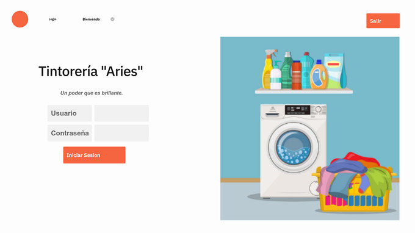
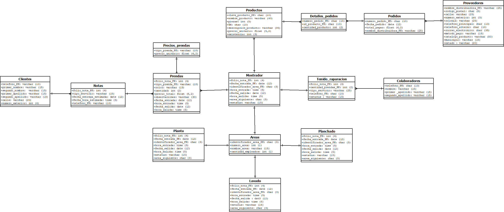
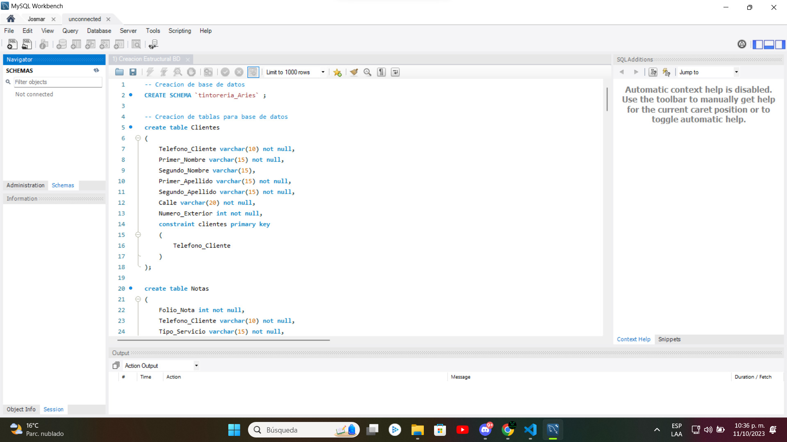
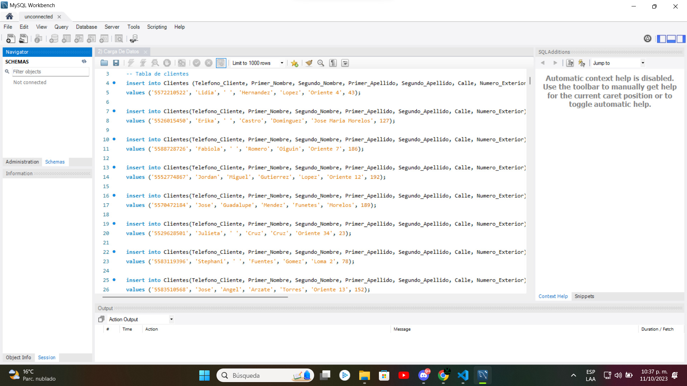
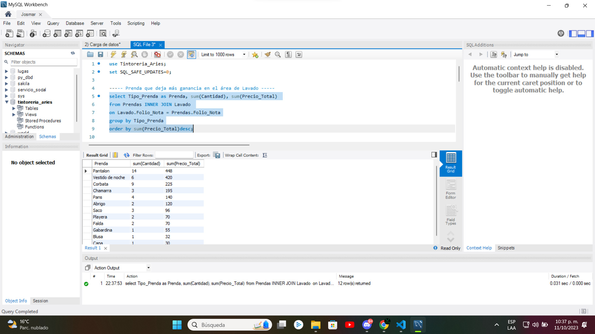
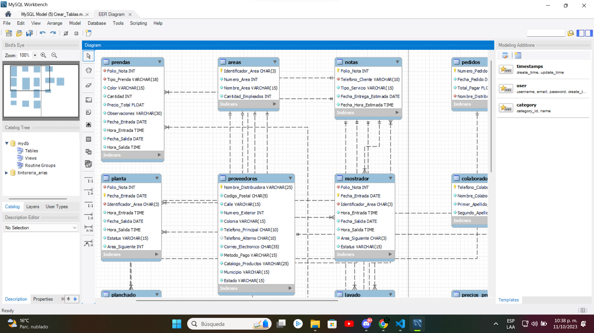
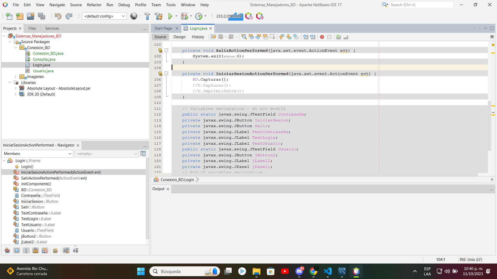

# Presentación

El siguiente proyecto es un repositorio integral de **diseño y desarrollo de una base de datos diseñada para satisfacer las necesidades específicas de 'Tintorería Aries'**. Este proyecto incluye elementos clave, desde la **estructura de la base de datos** hasta dos **métodos de conexión y un sistema de bitácora.** Cada aspecto ha sido diseñado meticulosamente para garantizar una solución efectiva y eficiente que contribuye al éxito de 'Tintorería Aries'.

<h1 align="center"> Sistema de Registro de Alumnos </h1>

 Pantalla principal de la interfaz 

# Tabla de contenidos:

---

- [Badges](#badges)
- [Capturas de pantalla](#capturas-de-pantalla)
- [Descripción del proyecto](#descripción-del-proyecto)
- [Herramientas utilizadas](#herramientas-utilizadas)
- [Guía de instalación](#guía-de-instalación)
- [Autor](#autores)
- [Información adicional](#información-adicional)

# Badges

---

- Estado del Proyecto: 
- Versión Actual: 
- Uso de dependencias: 
- Tipo de proyecto: 
- Categoría del proyecto: 
- Tipo de base de datos: 

# Capturas de pantalla

---

Las capturas de pantalla a continuación destacan puntos clave en el proceso de diseño y desarrollo del proyecto de la base de datos para "Tintorería Aries".

## Capturas de pantalla diagrama de relación

## Capturas de pantalla de creación y carga de datos

## Capturas de pantalla de consultas

## Capturas de pantalla de interfaz de usuario

# Descripción del proyecto

---

El presente repositorio representa un proyecto integral de diseño y desarrollo de una base de datos dirigido a satisfacer las necesidades específicas de 'Tintorería Aries'. Este proyecto incluye una serie de componentes clave que se han diseñado y construido meticulosamente:

1. **Diseño Estructural de la Base de Datos:** He creado una estructura sólida que garantiza la eficiente organización y almacenamiento de datos críticos para la operación de la tintorería.
2. **Carga de Datos:** Implemente un proceso de carga de datos cuidadosamente planificado para mantener la información actualizada y siempre disponible.
3. **Consultas Multitabla:** Desarrolle consultas avanzadas que involucran múltiples tablas, lo que permite un acceso rápido y efectivo a la información, facilitando la toma de decisiones.
4. **Constraints:** Establecí reglas y restricciones para asegurar la coherencia y confiabilidad de los datos almacenados.
5. **Bitácora:** Implemente una bitácora de actividades que registra en detalle cada operación realizada en la base de datos, proporcionando un historial completo de eventos.
6. **Función de Carga de Datos Brutos:** Se creó una función especializada para cargar datos en su forma original, antes de cualquier procesamiento, asegurando la integridad de la información.
7. **Dos Métodos de Conexión a la Base de Datos:** Diseñe dos métodos distintos para acceder a la base de datos:
   - La primera conexión se realiza a través de una interfaz de usuario desarrollada en JAVA, lo que brinda una experiencia amigable y eficiente para los usuarios.
   - La segunda conexión se establece a través de una red, permitiendo el acceso desde dispositivos móviles. Además, implemente un sistema de monitoreo en tiempo real para supervisar y garantizar un óptimo rendimiento de la base de datos.
     Este proyecto integral representa un paso significativo hacia la eficiencia y la gestión efectiva de datos para 'Tintorería Aries'. Las características implementadas aseguran que la tintorería cuente con una base de datos sólida y versátil que facilita la toma de decisiones y garantiza la satisfacción del cliente.

# Herramientas utilizadas

---

- [Microsoft Excel](https://www.microsoft.com/es-mx/microsoft-365/excel)
- [Dia Diagram Editor](http://dia-installer.de/download/index.html.en)
- [MySQL Workbench 8.0.34](https://dev.mysql.com/downloads/workbench/)
- [Java 8](https://www.java.com/es/download/ie_manual.jsp)
- [Apache NeatBeans 17](https://netbeans.apache.org/download/nb17/)
- [MySQL Connector 8.0.28](https://dev.mysql.com/doc/relnotes/connector-j/8.0/en/news-8-0-28.html)
- [RemoDB SQL Client MySQL, MsSQL](https://play.google.com/store/apps/details?id=com.kriskast.remotedb&hl=es_MX&gl=US)
- [ManageEngine Applications Manager](https://www.manageengine.com/latam/applications_manager/monitoreo-de-base-de-datos.html)
- [ColorCode](https://htmlcolorcodes.com/es/)
- [Shields.io](https://shields.io/badges/static-badge)

# Guía de instalación

---

¡Bienvenido al repositorio del proyecto de base de datos de la 'Tintorería Aries'! A continuación, encontrarás una guía paso a paso para descargar, configurar la base de datos y comenzar a trabajar con este proyecto en NetBeans.

1. **Descargar el Repositorio:**

   - Ve al repositorio en GitHub: ttps://github.com/Josmar360/Tintoreria_Aries_BD
   - Haz clic en el botón verde "Code" y selecciona "Download ZIP".
   - Descomprime el archivo ZIP en la ubicación de tu elección.

2. **Configurar la Base de Datos:**

   - Abre MySQL Workbench en tu máquina. Si aún no lo tienes instalado, puedes descargarlo desde el sitio oficial: Descargar MySQL Workbench.
   - Inicia sesión en MySQL Workbench con tus credenciales.
   - En MySQL Workbench, crea una nueva conexión a la base de datos utilizando la información proporcionada en el proyecto. Asegúrate de tener acceso al servidor MySQL.
   - En la pestaña "Server" de MySQL Workbench, selecciona la nueva conexión creada y abre un nuevo script SQL.
   - Copia y pega el script SQL proporcionado en el proyecto para crear la estructura de la base de datos. Ejecuta el script para crear las tablas y definir las restricciones.
   - A continuación, carga los datos en la base de datos utilizando el proceso de carga de datos bruto. Esto asegurará que la información esté disponible y actualizada.

3. **Iniciar el Proyecto en NetBeans:**

   - Abre NetBeans en tu máquina. Si aún no lo tienes instalado, puedes descargarlo desde el sitio oficial: Descargar NetBeans.
   - Importa el proyecto desde el repositorio que descargaste previamente. Ve a "File" > "Open Project" y selecciona la carpeta del proyecto.
   - Asegúrate de configurar las conexiones de base de datos en NetBeans según las especificaciones proporcionadas en el proyecto. Esto te permitirá acceder a la base de datos desde la aplicación.
   - Abre el proyecto la cual te permitira ver la conexión a la base de datos de la 'Tintorería Aries'.

# Autor/es

---

[Josmar Gustavo Palomino Castelan](https://linktr.ee/josmar360)

# Información adicional

---

Este proyecto tiene como objetivo la aplicación práctica de los conocimientos en el diseño y desarrollo de una base de datos. A través de este proyecto, busco aplicar mis destrezas en un contexto real, creando una solución para una tintorería denominada 'Tintorería Aries'. Mi meta es no solo adquirir experiencia en la creación de bases de datos, sino también demostrar la utilidad y aplicabilidad de mi conocimientos en un escenario empresarial tangible.

- [Regresar al inicio](#presentación)
